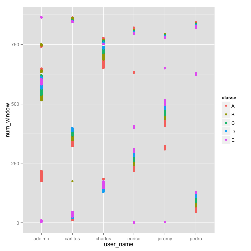
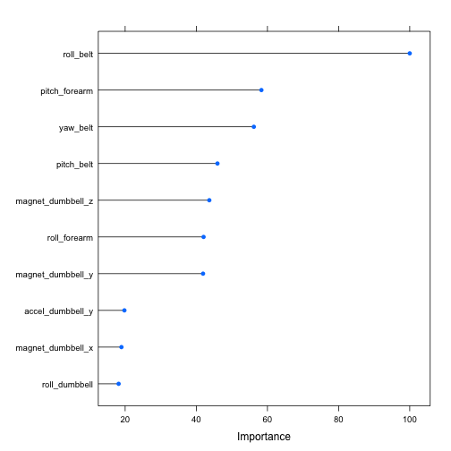

Practical Machine Learning Assignment
========================================================

## Executive Summary

This paper aims to predict whether a participant is performing an exercise correctly. The data used pertains to health exercises where 6 participants were asked to perform a series of bar-bell exercises correctly and incorrectly. The objective of this paper was to develop a model that accurate predicts whether a participant performed the exercise correctly based on data collected from accelerometers placed on the belt, forearms, arms and dumbells of participant. This data was available from: http://groupware.les.inf.puc-rio.br/har. 

Using various techniques we were able to generate a strong predictive models using the random forest method that yielded high levels of accuracy, low out of bag errors, sensitivity and specificity.

## Preliminaries

We begin by loading libraries we expect to use for this analysis.


```
## randomForest 4.6-10
## Type rfNews() to see new features/changes/bug fixes.
## Loading required package: lattice
## Loading required package: ggplot2
```


We download the files here and read them into dataframes. Having inspected the data first, we note observed that there are Excel divide by zero and blank cells. We deal with this as we read in our data and set those to NAs:


```r
# download.file('http://d396qusza40orc.cloudfront.net/predmachlearn/pml-training.csv',
# 'pml-training.csv')
# download.file('http://d396qusza40orc.cloudfront.net/predmachlearn/pml-testing.csv',
# 'pml-testing.csv')
trainEx <- fread("pml-training.csv", na.strings = c("#DIV/0!", ""))
testEx <- fread("pml-testing.csv", na.strings = c("#DIV/0!", ""))
```


## Exploratory Analysis

Having observed that there are na values, we want to identify how many variables are affected by NA values as this will affect our predicition model. 

We find that 100 variables are affected by NA values. In each of those we see that there are more than 19,000 observations that are NA. As the number of NAs is so high (as a % of 19,622 observations), we do not want to impute their values from such a small subset of data. The best option is to then delete the colums from our analysis.


```r
str(trainEx)
trainEx[, sapply(.SD, function(x) sum(is.na(x)))]  # show NAs per variable
table(trainEx[, sapply(.SD, function(x) sum(is.na(x)))] < 19000)  # identify # of variables with NAs 
ggplot(trainEx, aes(x = user_name, y = num_window, colour = classe)) + geom_point()  # chart data-collection related variables
```

 


We observed in addition to the NA columns the first couple of columns such as "user_name", "raw_timestamp_part_1", "raw_timestamp_part2", "cvtd_timestamp". Charting some of these, we can see they related to the data collection process and as such as less likely to provide predictive power so we excluded such variables in the model. 


```r
na.cols <- trainEx[, sapply(.SD, function(x) any(is.na(x)))]
trainExFeatures <- trainEx[, eval(names(which(na.cols == FALSE))), with = FALSE]
str(trainExFeatures)  # inspect new datatable; no NAs present
dim(trainExFeatures)  # new number of variables is 60
trainExFeaturesDF <- as.data.frame(trainExFeatures)
trainFeatures <- trainExFeaturesDF[, 8:60]  # exclude variables related to data collection that aren't useful for prediction
```


After this process of elimination of variables we are left with 53 variables including the "classe" variable which we are trying to predict. We convert this to a factor variable in order to build a model and apply the above transformations to our test set as well so that the training set and testing set have been transformed in the same manner.


```r
# make classe
trainFeatures$classe <- as.factor(trainFeatures$classe)

# 
na.cols <- testEx[, sapply(.SD, function(x) any(is.na(x)))]
testExFeatures <- testEx[, eval(names(which(na.cols == FALSE))), with = FALSE]
testExFeaturesDF <- as.data.frame(testExFeatures)
testFeatures <- testExFeaturesDF[, 8:60]
testFeatures$classe <- as.factor(testFeatures$classe)
```

```
## Error: replacement has 0 rows, data has 20
```


## Prediction

For our model, random forest was chosen as the preferred model. Despite the challenge to interpreting such models, they often generate high levels of prediction accuracy and this was the reason for it being our choice. We decided to utilise cross-validation and split the training set into a training set and a cross validation set to estimate the out of bag error (OOB).


```r
set.seed(117)
inTrain <- createDataPartition(trainFeatures$classe, p = 0.7, list = FALSE)
modelTrain <- trainFeatures[inTrain, ]
modelCV <- trainFeatures[-inTrain, ]
```


Fitting the model to a random forest, we use a 5 fold cross validation on the training data. The number of variables to split at each level in the random forest was 2, 27 and 52. The one with the highest accuracy was mtry = 27 with 99.1% accuracy and it is the optimal model selected by our training algorithm. 

It would be argued that the 0.1% gain in accuracy by splitting on 27 levels as opposed to splitting on 2 variables which yields 99% is minimal and that we should opt for the less complicated model. However, the train function in caret automatically selects for us the model which here is the one with mtry = 27.

The confusion matrix on the cross validation set reveals a 99.2% accuracy with a 95% confidence interval of 98.9% to 99.41% and a significant P value of 2.2e-16. The OOB is 0.8% and the specificity and sensitivity of hte model are both high across all classes of the exercise being made.


```r
modFit <- train(classe ~ ., data = modelTrain, method = "rf", trControl = trainControl(method = "cv", 
    number = 5))
```

```
## Loading required namespace: e1071
```

```r

# inspect model fitted
modFit

# test on validation set
cv_pred <- predict(modFit, newdata = modelCV)
confusionMatrix(cv_pred, modelCV$classe)
```


One of the challenges of utilising a random forest is it's interpretability. We inspect the top 10 variables used in the construction of our random forest model and observe that the most critical variable was roll belt at 100%. The next few were forearm pitch, the yaw belt, magnet dumbbell in the y-direction, the rolling of the forearm, and lastly the magnet dumbell in the z direction. 

After these variables the importance of the other variables are significantly less. Hence, if we are predicting the performance of a dumbbell curl and the way in which it is performed, these 6 variables are the most important in the random forest model and would be the ones we would pay more attention to in recommending to people exercising if they were performing th exercise correctly.


```r
plot(varImp(modFit), top = 10)
```

 


Lastly, we predict the data in the test set based on the model we have fitted and write the answers to separate files to be uploaded separately.


```r
predTest = predict(modFit, testFeatures)  # assign the answers to the test set to a vector to be written to file

# function to write files
pml_write_files = function(x) {
    n = length(x)
    for (i in 1:n) {
        filename = paste0("problem_id_", i, ".txt")
        write.table(x[i], file = filename, quote = FALSE, row.names = FALSE, 
            col.names = FALSE)
    }
}
pml_write_files(predTest)  # call function to write answers to file
```


## Conclusion
Our model predicted all 20 instances in the test set of data accurately. While the model did this accurate, a limitation as noted in the analysis is that the mtry variable could be set to 2 with little penalty to accuracy, specificity and sensitivity. 

This would have made for a relatively simpler model. However, the default setting of caret assigns the optimal model fit. An option in the alternative could have been to use the random forest package itself and rely on manually selecting the tuning parameters.
